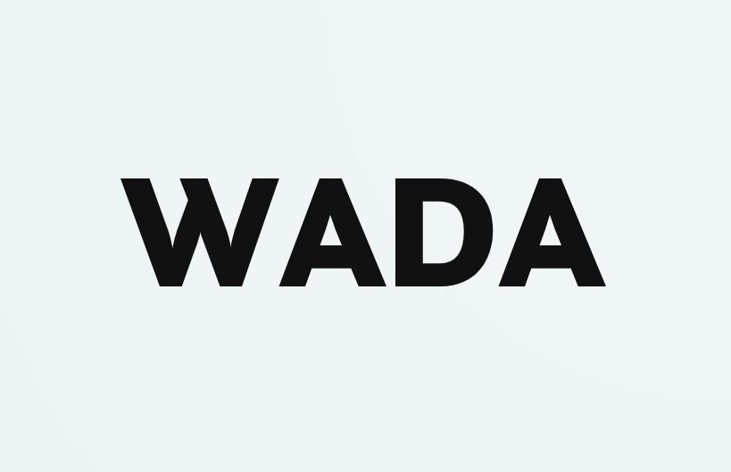

# Wise AI Debate Assistant, WADA

<div align="center">
  
</div>

## Overview


AI-driven debate uses large language models to simulate discussions between virtual debaters, presenting arguments from opposing viewpoints on various topics. It enhances decision-making by providing comprehensive analyses of multiple perspectives, promoting critical thinking, broadening horizons, and sometimes leveraging helpful tools. 

This application, named "Wise AI Debate Assistant," is designed to assist users in making difficult decisions by leveraging the power of AI-driven debate. People often face challenging dilemmas where they find themselves torn between two choices, like “should I go to graduate school or find a job immediately?”. WADA aims to understand your current situation, explore your preferences, and initiate a debate between AI debaters on the topic at hand. By analyzing their arguments, the application provides you with a decision.


## How the application works

1. User Input: Users provide the application with information about the dilemma they are facing. This can be done by typing their situation, explaining the two options they are considering, and any relevant factors or concerns.

2. Context Understanding: The application employs natural language processing techniques to comprehend and analyze the user's input. It identifies key aspects of the problem, potential biases, and underlying motivations.

3. AI Debaters: Based on the user's input, the application generates two AI debaters, both equipped with sophisticated language models.

4. Debate Generation: The AI debaters engage in a structured debate, presenting arguments and counter-arguments to support their respective positions. In addition, they are good at leveraging tools to make their arguments more grounded and persuasive. The tools include search engine, Wikipedia, arXiv. The debate unfolds in a conversational manner, resembling a dialogue between two individuals with contrasting viewpoints.

5. Argument Analysis: As the debate progresses, the application employs another language model to evaluate the strength, persuasiveness, and relevance of each argument presented by the AI debaters. It considers factors like logical coherence, supporting evidence, and potential biases.

6. Decision Recommendation: The application synthesizes the arguments from both sides and generates a comprehensive analysis of the dilemma. It provides a decision recommendation based on the insights gained from the debate and the user's initial input. The recommendation considers a balance between the two perspectives, highlighting potential risks, benefits, and aligning with the user's preferences.

The goal of this application is to assist users in gaining a deeper understanding of their dilemmas by exploring contrasting viewpoints in an AI-driven debate. It aims to provide valuable insights, provoke critical thinking, and facilitate decision-making processes in complex situations. 


## Demo


## Case Book

[WADA Case Book](https://wada-1.gitbook.io/wada-casebook/)

## Installation
Clone the repository first and enter the project directory.
```
# Create a virtual environment
python3 -m venv env

# Activate virtual environment
env\Scripts\activate          (For Windows) 
source env/bin/activate       (For MacOS)

# Install dependencies
pip install -e .
```


After running
```
# Deactivate virtual environment
deactivate

# Remove virtual environment
rm -r env
```


## Example

Add your Azure OpenAI API key, base and version to system environment variables.

For Bash shell (Linux, macOS, Git Bash on Windows)

```bash
export OPENAI_API_KEY=<Your Azure OpenAI API key>
export OPENAI_API_BASE=<Your Azure OpenAI API base>
export OPENAI_API_VERSION=<Your Azure OpenAI API version>
```

For Windows Command Prompt

```cmd
set OPENAI_API_KEY=<Your Azure OpenAI API key>
set OPENAI_API_BASE=<Your Azure OpenAI API base>
set OPENAI_API_VERSION=<Your Azure OpenAI API version>
```

For Windows PowerShell

```powershell
$env:OPENAI_API_KEY="<Your Azure OpenAI API key>"
$env:OPENAI_API_BASE="<Your Azure OpenAI API base>"
$env:OPENAI_API_VERSION="<Your Azure OpenAI API version>"
```

Replace `<Your Azure OpenAI API key>` with your actual Azure OpenAI API key in each case. The same applies to base and version. Make sure there are no spaces around the `=` sign.

Use the same command if you want to specify the GPT model name `<OPENAI_API_GPT_4>` and `<OPENAI_API_GPT_3_5_TURBO>` .


After setting the environment variables, you can run the example script.

```
python examples/debate_with_host_and_search.py
```

Run the demo application, and open the link in the browser.
```
python app/run_search.py
```

Or, use gradio command
```
cd app
python run_search.py
```


## Contributing

This project welcomes contributions and suggestions.  Most contributions require you to agree to a
Contributor License Agreement (CLA) declaring that you have the right to, and actually do, grant us
the rights to use your contribution. For details, visit https://cla.opensource.microsoft.com.

When you submit a pull request, a CLA bot will automatically determine whether you need to provide
a CLA and decorate the PR appropriately (e.g., status check, comment). Simply follow the instructions
provided by the bot. You will only need to do this once across all repos using our CLA.

This project has adopted the [Microsoft Open Source Code of Conduct](https://opensource.microsoft.com/codeofconduct/).
For more information see the [Code of Conduct FAQ](https://opensource.microsoft.com/codeofconduct/faq/) or
contact [opencode@microsoft.com](mailto:opencode@microsoft.com) with any additional questions or comments.


## Trademarks

This project may contain trademarks or logos for projects, products, or services. Authorized use of Microsoft 
trademarks or logos is subject to and must follow 
[Microsoft's Trademark & Brand Guidelines](https://www.microsoft.com/en-us/legal/intellectualproperty/trademarks/usage/general).
Use of Microsoft trademarks or logos in modified versions of this project must not cause confusion or imply Microsoft sponsorship.
Any use of third-party trademarks or logos are subject to those third-party's policies.